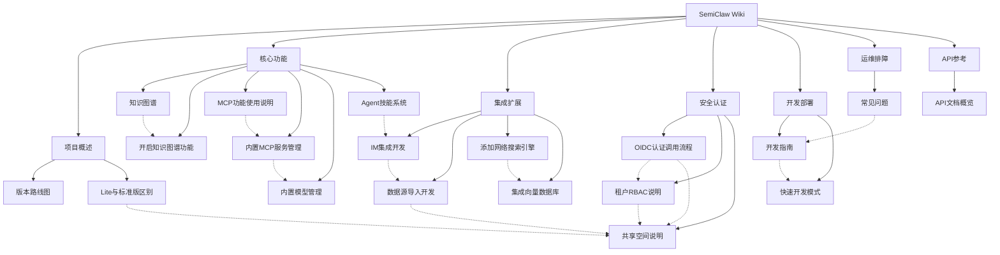

# SemiClaw Wiki

欢迎使用 SemiClaw 知识库 wiki！这里是 SemiClaw 项目文档的互联知识网络，所有页面通过双向链接关联，帮助你从任意入口探索整个知识体系。

---

## 项目概述

| 页面 | 简介 |
|------|------|
| [版本路线图](项目概述/版本路线图.md) | 产品规划与计划方向 |
| [Lite与标准版区别](项目概述/Lite与标准版区别.md) | 轻量版与标准版的功能对比 |

## 核心功能

| 页面 | 简介 |
|------|------|
| [知识图谱](核心功能/知识图谱.md) | Neo4j 知识图谱的快速开始与使用 |
| [开启知识图谱功能](核心功能/开启知识图谱功能.md) | 知识图谱功能的完整启用流程 |
| [MCP功能使用说明](核心功能/MCP功能使用说明.md) | MCP 服务的用户操作指南 |
| [内置MCP服务管理](核心功能/内置MCP服务管理.md) | 内置 MCP 服务的系统级管理 |
| [内置模型管理](核心功能/内置模型管理.md) | 内置模型的系统级管理 |
| [Agent技能系统](核心功能/Agent技能系统.md) | Agent Skills 扩展机制与预加载技能 |

## 集成与扩展

| 页面 | 简介 |
|------|------|
| [IM集成开发](集成扩展/IM集成开发.md) | 企业即时通讯平台接入开发 |
| [数据源导入开发](集成扩展/数据源导入开发.md) | 外部平台数据自动同步与导入 |
| [添加网络搜索引擎](集成扩展/添加网络搜索引擎.md) | 扩展新的网络搜索 Provider |
| [集成向量数据库](集成扩展/集成向量数据库.md) | 集成新的向量数据库检索引擎 |

## 安全与认证

| 页面 | 简介 |
|------|------|
| [OIDC认证调用流程](安全认证/OIDC认证调用流程.md) | OIDC 第三方登录的完整调用链路 |
| [租户RBAC说明](安全认证/RBAC说明.md) | 租户内角色矩阵、资源归属与审计 |
| [共享空间说明](安全认证/共享空间说明.md) | 跨租户协作与知识库/智能体共享 |

## 开发与部署

| 页面 | 简介 |
|------|------|
| [开发指南](开发部署/开发指南.md) | 本地开发环境搭建与工作流 |
| [快速开发模式](开发部署/快速开发模式.md) | 后端/前端热更新开发模式 |

## 运维与排障

| 页面 | 简介 |
|------|------|
| [常见问题](运维排障/常见问题.md) | 部署与使用中的 FAQ |

## API 参考

| 页面 | 简介 |
|------|------|
| [API文档概览](API参考/API文档概览.md) | RESTful API 基础信息与分类索引 |

---

## 知识图谱

---

## 反向链接

本页为 wiki 首页，所有页面均链接回此处。
